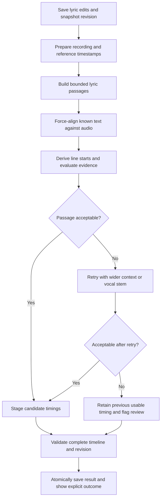

# Audio-led lyric timing with human reference points

Implementation proposal for Lyric Memorizer · September 9, 2026

## Decision

Make **forced alignment of the known lyrics against the recording** the primary timing engine behind **Save & redo timings**. Use human-measured timestamps to guide the search and detect errors. Return one useful start time per lyric line; precise word highlighting is optional.

Start with **Stable-ts using the existing Whisper small model**, because a local experiment on Gorgeous produced promising line boundaries without asking the model to transcribe the lyrics correctly first. Treat this as a candidate implementation until it passes listening-based evaluation. WhisperX’s phoneme alignment is a possible comparison engine if Stable-ts fails the benchmark; do not build both pipelines initially.

**Implementation status (updated September 9, 2026):** the forced-alignment preview is now implemented and connected to Save & redo timings. The legacy backend default remains available. Real-model runs have been performed on Gorgeous, Cards, and Jealous Type; human onset-accuracy validation is pending. The user chose to listen and provide corrections afterward. See [implementation and test results](./FORCED_ALIGNMENT_TEST_RESULTS.md) and the [setup instructions](./README.md#forced-lyric-alignment-preview). The plan below remains the design and acceptance reference; model output must not be described as listening-verified.

## What needs to change

The current process can:

- Fail to recognize sung words that we already have in the lyric text.
- Assign adjacent repeated phrases to the wrong occurrence.
- Carry a catalog’s offset or incorrect line boundaries into playback.
- Report high timing coverage while the lyrics are audibly out of sync.
- Preserve automatically generated timestamps as if they were trustworthy reference points.

Previous tests verified saving, coverage, and seeking. They did not establish that a click lands at the sung line’s onset. The replacement must measure that directly.

## What the experiment established

The isolated experiment used Stable-ts 2.19.1, Whisper `small`, CPU execution, the original Gorgeous recording, known lyric text, and bounded audio clips. It preserved the supplied line breaks. Silence suppression and non-speech skipping were disabled for this trial because ordinary speech-detection assumptions can discard singing.

The intro was aligned within 0–23.53 seconds, using the first catalog chorus start as an approximate boundary. The model returned:

| Intro line | Estimated start | Estimated end |
| --- | ---: | ---: |
| First “Say it to me, babe” | 0.26 | 3.52 |
| First “I couldn’t believe” | 4.60 | 6.24 |
| Second repetition | 10.18 | 11.48 |
| Third repetition | 14.04 | 17.00 |
| Last “Say it to me, babe” | 19.48 | 23.28 |

A second trial aligned six chorus lines inside a 22.5–35.5-second clip. Both trials produced line boundaries. **These results were not listening-verified ground truth.** Forced alignment can place supplied text even when that text is wrong, missing from the performance, or poorly supported by the audio. A complete output is insufficient evidence of correctness.

The experimental environment used Python 3.11, Stable-ts 2.19.1, Torch 2.11.0, and Torchaudio 2.11.0. The existing worker had a different Torch version. Preserve dependency isolation during evaluation; do not replace the worker’s shared ML stack to enable an experiment.

## Proposed end-to-end process



### 1. Preserve the recording and canonical lyrics

Use the exact local recording the player uses. Validate duration and decode to a documented sample rate. Record a content hash so results cannot silently be reused against a different edit or upload.

Keep canonical lyric text, line IDs, section IDs, and emoji references stable when running timing-only updates. Prepare a separate alignment transcript with explicit mappings back to canonical line and token IDs.

Normalize whitespace, punctuation, and apostrophes for matching. Handle hyphenated refrains consistently. Never change the displayed lyric text as an incidental alignment operation.

Backing vocals and parenthetical ad-libs may overlap the main vocal or appear in a different textual order. Preserve the words, but distinguish the main phrase from optional backing phrases in the alignment representation. A late backing vocal should not drag the next main lyric’s start forward. Flag ambiguous phrases instead of forcing a single sequential interpretation.

### 2. Give reference timestamps explicit trust levels

| Reference | Intended use |
| --- | --- |
| User-verified timestamp on this exact recording | Locked boundary unless the user requests re-timing it |
| Imported human timing, such as LRCLIB | Soft guide; may belong to another edit or have an offset |
| Previously generated model timing | Candidate evidence; eligible for correction |
| Proportional draft timing | Display/editing placeholder; never a trusted anchor |

The existing confidence threshold used by `usable()` is not sufficient to classify reference quality. A clickable timestamp is not necessarily accurate.

Compare several distributed references before trusting an imported time base. Detect global offset, drift, and inserted material. An offset fit may help propose windows, but do not apply a global shift blindly across a music-video interlude or edited recording.

### 3. Build short passages with context

Use sections, lyric order, and soft references to propose approximately 10–25-second passages. These are starting parameters to tune, not accuracy guarantees.

- Include neighboring lyric context, particularly around repeated openings.
- Add a few seconds of audio padding where neighboring boundaries allow it.
- Start an untimed intro at recording time zero; end it near the first reliable subsequent reference, with appropriate padding.
- Do not use a draft line’s guessed start or end to crop out its real performance.
- Avoid cutting through a line when a nearby phrase boundary is available.
- Assign each canonical line to one owning passage. Context lines may appear in adjacent passages, but must not create duplicate saved lines.
- Reconcile overlapping results using stable IDs, boundary consistency, and evidence quality.

If no references exist, run an ordered coarse pass over the recording to propose boundaries, then re-align bounded passages. Do not give each repeated phrase an unconstrained independent search across the entire song.

### 4. Align the provided text

The model’s task is to place the supplied words in the audio. Free transcription can provide secondary evidence, but missing transcription words must not block alignment.

A minimal reproduction of the tested approach:

```python
import stable_whisper
import whisper

model = stable_whisper.load_model("small", device="cpu")
audio = whisper.load_audio(recording_path)  # Whisper's 16 kHz waveform
clip = audio[int(window_start * 16000):int(window_end * 16000)]
text = "\n".join(line.text for line in passage_lines)

result = model.align(
    clip,
    text,
    language=language_code,
    original_split=True,
    regroup=False,
    suppress_silence=False,
    nonspeech_skip=None,
    max_word_dur=None,  # Singing can sustain words beyond speech limits.
    word_dur_factor=None,
    verbose=None,
)

# Validate result before use. Its timestamps are relative to the clip:
# absolute_time = window_start + relative_time
# Map through explicit line IDs; do not assume segment counts always match.
```

Load the model once per job/process instead of once per line. Make language explicit and configurable; the experiment used English, but the application should not silently assume every song is English.

Stable-ts also provides `align_words()` for text with supplied segment bounds. Evaluate it when those bounds are dependable. Tight but incorrect windows will constrain the answer incorrectly, so begin with passage-level `align()` for uncertain catalog timings.

### 5. Derive useful line timing

For each canonical line, derive:

- **Start:** the supported onset of its main sung phrase.
- **Vocal end:** the supported end of that phrase.
- **Display interval:** how long the UI should keep the lyric visible, potentially through a following instrumental gap.

Keep vocal timing and display behavior distinct. A long display interval is not evidence that someone sings for the whole interval.

Words can be used internally to locate line boundaries without promising word-level accuracy. Mark estimated internal token timing honestly, and do not enable precise word practice merely because line alignment succeeded.

### 6. Evaluate and retry uncertain passages

Check each passage for:

- Finite, in-range timestamps and positive durations.
- Line starts in canonical order, with explicit handling of overlapping backing vocals.
- Zero-duration or collapsed words/lines.
- Implausibly stretched phrases and repeated phrases assigned to the same instant.
- Lines unexpectedly placed at the crop edge.
- Disagreement with recording-verified references.
- Large differences between overlapping passage estimates.
- Evidence that supplied text is absent or does not match this performance.

Model probabilities, alignment shape, and reference agreement are evidence signals. Do not present their combination as a calibrated probability of correctness until it has been evaluated.

Use a bounded retry sequence:

1. Expand context or move the passage boundary.
2. Try the vocal stem if the original mix is ambiguous; cache stems and preserve the recording’s time base.
3. Optionally try a configured larger model on the uncertain passage.
4. Flag the passage for review if evidence remains insufficient.

Do not separate vocals for every run by default. Compare separation quality and runtime on the benchmark before making it automatic. Separation artifacts can also harm alignment.

## Integration into the current repository

| File or proposed module | Responsibility |
| --- | --- |
| `services/audio_worker/app.py` | Make the existing alignment job orchestrate the new pipeline; retain revision checks and background progress |
| Proposed `services/audio_worker/forced_alignment.py` | Model adapter, passage inference, timestamp conversion, and evidence extraction |
| Proposed `services/audio_worker/alignment_windows.py` | Reference trust, passage construction, context ownership, and overlap reconciliation |
| `services/audio_worker/lrclib.py` | Discover and normalize soft reference timings; catalog acceptance must not gate audio alignment |
| `services/audio_worker/timing_gaps.py` | Temporary legacy fallback during rollout, not the central timing engine |
| `services/audio_worker/database.py` | Atomic revision-checked persistence; preserve independent annotations |
| `src/types.ts` | Explicit line timing quality and alignment-job outcome types |
| `src/lib/rehearsal.ts` | Separate clickable line timing from precise word-practice eligibility |
| `src/pages/ImportPage.tsx` | Progress and result presentation for Save & redo timings |
| `src/pages/PlayerPage.tsx` | Show timing quality/review state without equating coverage with accuracy |

Keep the existing job endpoint initially. Use a configurable engine selector during development, for example `LYRIC_ALIGNMENT_ENGINE=legacy|forced`. Deploy the new engine as default only after evaluation passes. Record which engine actually ran, including any fallback.

Use a dedicated alignment environment or worker with pinned, compatible dependencies. Document its installation and model-cache location. If it is unavailable, report that directly; do not silently label a legacy run as forced alignment.

## Data and persistence

Introduce explicit timing provenance and quality without treating older records as newly verified. Suggested fields:

```text
line.timingSource: manual | catalog | forced_alignment | draft | legacy
line.timingQuality: verified | supported | needs_review | untimed
line.timingEvidence:
    engine, model, engineVersion, runId, passageId
    referenceIds, referenceDeviationSeconds
    zeroDurationFraction, cropEdgeWarning, reviewReasons

alignmentRun:
    recordingHash, lyricsHash, inputRevision
    engineConfiguration, windowPlan, modelVersion
    outcome, recoveredCount, revisedCount, reviewCount
    elapsedSeconds, candidateArtifactPath
```

Keep the existing `verified` field during migration, but never set it merely because a model or catalog emitted timestamps. Retain raw model scores separately from derived quality labels.

Stage candidate timings before applying them. Validate identity, bounds, timeline consistency, locked references, and the input revision. If the user changed lyrics or timings during processing, reject the stale write. Preserve lyrics, emoji pins, readiness, and listening history.

Store a recoverable pre-run timing snapshot and enough candidate evidence to investigate regressions. Cache inference by recording hash, lyric representation, window bounds, model/version, and relevant settings. Invalidate affected passages after edits. Respect the existing alignment revision mechanism that invalidates outdated practice ranges.

## What Save & redo timings should say

Show named phases:

1. Saving edits.
2. Preparing recording and reference points.
3. Aligning passage 3 of 12.
4. Rechecking uncertain passages.
5. Checking and saving timings.

Distinguish outcomes:

| Outcome | Example |
| --- | --- |
| Applied | “Line timing updated. Review the highlighted passages.” |
| Partial | “Updated 88 lines; 6 lines need review. Previous usable timing was retained where recovery was uncertain.” |
| Unchanged | “Timing check finished. No better supported timings found; existing timing kept.” |
| Failed | “Lyrics were saved, but the alignment model could not run. Existing timing kept.” |

A completed job means the process finished. It does not certify synchronization accuracy. Avoid presenting “all changes saved” as the only status for a partial or failed timing run.

## How we should prove accuracy

### Build a listening-verified benchmark first

Use Gorgeous as a regression case, not the sole benchmark. Include several recordings with:

- Repeated intro lines and repeated choruses.
- Sung refrains and melisma.
- Fast rap, spoken interludes, and backing vocals.
- Leading silence, instrumental breaks, and music-video edits.
- Imperfect or incomplete supplied lyrics.
- Multiple supported languages if multilingual support is claimed.

Manually mark line onsets on the exact benchmark recordings using playback and waveform inspection. Record uncertainty ranges where an onset is ambiguous. Keep evaluation labels separate from reference anchors supplied to the model: use held-out lines/passages to measure generalization, rather than measuring agreement with boundaries it was given.

### Measure onset errors and occurrence mistakes

Compare the new engine with the existing catalog-only and transcription-matching results using:

- Median and 90th-percentile absolute line-start error.
- Fraction of line starts within 0.5 seconds of a human-reviewed onset.
- Number of errors exceeding 1 second.
- Wrong-occurrence assignments, including jumps into a later chorus.
- Unresolved rate and automatic acceptance rate.
- Runtime on the target Mac, including cold model loading and optional separation.

Provisional goals for automatically accepted lines: median error at most 0.3 seconds, 90th percentile at most 0.75 seconds, and no wrong-occurrence jumps in the release benchmark. These are proposed product goals, not measured current performance. Report review/abstention rates alongside accuracy so a system cannot appear successful by accepting only easy lines.

### Automated and interactive tests

Add deterministic tests for timestamp conversion, line-ID preservation, repeated phrases, hyphenated refrains, missing lyrics, locked references, zero-length output, crop boundaries, overlap reconciliation, and concurrent edits. Mock the model for orchestration and persistence tests; do not mistake those tests for model-accuracy evaluation.

Add a separately invoked local model benchmark with pinned configuration and saved outputs. Keep large audio and model weights out of Git. Use recordings available for local testing and store compact evaluation annotations.

Finally run the actual **Save & redo timings** button. Reopen the saved song, seek to sampled early/middle/late lines, and listen. Verify persistence and partial-result messaging. A browser test asserting that a slider reached a timestamp proves seeking; human-reviewed audio comparisons establish whether that timestamp is useful.

## Implementation order

1. **Benchmark and prototype:** retain reproducible experimental output, define human-reviewed labels, and compare Stable-ts against current timing.
2. **Passage planner and adapter:** implement explicit reference trust, stable line mapping, and line-boundary extraction behind the engine selector.
3. **Validation and retries:** add evidence-based acceptance, wider-context retries, and optional vocal-stem evaluation.
4. **Persistence and UI:** stage/validate results, retain rollback snapshots, and present applied/partial/unchanged/failed outcomes.
5. **End-to-end acceptance:** run Gorgeous plus the broader benchmark through the real UI and check audio synchronization.
6. **Default rollout:** enable the forced engine when measured accuracy improves; retain an explicit legacy escape hatch until regressions are understood.

Do not spend the first iteration building precise word animation, multiple competing engines, or a new editing interface. The initial deliverable is reliable line jumping and following, supported by measured onset accuracy and a clear review path.

## Technical references

- [Stable-ts: alignment and bounded alignment documentation](https://github.com/jianfch/stable-ts#alignment)
- [WhisperX: alignment implementation](https://github.com/m-bain/whisperX/blob/main/whisperx/alignment.py)
- [WhisperX paper, Interspeech 2023](https://www.isca-archive.org/interspeech_2023/bain23_interspeech.pdf)

Read the documentation for the pinned dependency version during implementation. The repository links above can change independently of the versions tested here.
