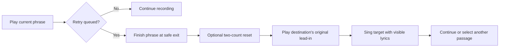

# Lyric Memorizer: Adaptive Rehearsal Player

**Date:** September 5, 2026  
**Status:** Playback-first release implemented September 5, 2026. See [USER_GUIDE.md](./USER_GUIDE.md) for the shipped controls and [README.md](./README.md) for setup and verification. The design and evaluation roadmap below preserves the original rationale; future research criteria are not claims of measured learning results.  
**Precedence:** This document supersedes the flashcard, hidden-word, vocal-dropout testing, and FSRS requirements in [PRODUCT_BLUEPRINT.md](./PRODUCT_BLUEPRINT.md). The old document remains historical context.

## Current strategy: singer-led section rehearsal

This update supersedes the line-feedback and spaced-return proposals below. The practice unit is a complete verse, chorus, bridge, or other named lyric section.

1. **Choose:** a central section picker shows name, opening lyric, time range, and last confidence rating. Repeated choruses retain separate occurrence identities. Headings define sections; the Timing editor repairs boundaries and labels.
2. **Sing:** choosing starts that entire section on repeat. Lyrics stay visible. Optional confirmed beat count-ins give a short reset between passes. There are no automatic line detours or timed practice schedules.
3. **Reflect:** Needs practice (J), Getting there, and Ready (K) express confidence in the section. Ratings never pause playback, force a transition, or claim measured mastery.
4. **Move on:** choose another section while singing; switch at the current section ending. A paused selection starts immediately. Listen releases repetition and continues the original recording.
5. **Return:** saved ratings orient the next session, but the singer chooses what to rehearse.

**Layout:** show section cards in the central stage before rehearsal, then large lyrics during singing. Keep the three confidence controls and Choose / change section visible beside the persistent transport, including on mobile. The desktop sidebar shows the active section, repeat count, upcoming section switch, and saved ratings. Search and detailed timing remain secondary.

Direct lyric clicks remain available and enter Listen mode. Custom ranges are optional precision controls. Existing line practice history is preserved but no longer drives the experience. The repo review and earlier design below are historical rationale, not current behavior. See USER_GUIDE.md for shipped controls.

## 1. The product to build

Build a beautiful, responsive lyric player that helps someone spend their next few minutes on the parts of a song they actually need to rehearse.

The promise is:

> **Sing along. Mark where you stumble. Come back in on the beat.**

The lyrics stay visible. The song supplies the rhythm, melody, and context. The user can jump directly to any line, repeat a phrase, and tell the player “Again” or “Got it” while singing. The player uses those signals to arrange the next rehearsal passage, with a predictable lead-in and fewer unnecessary chorus repetitions.

This is a substantial workflow change. Remove the hidden words, hint system, question/answer phases, Flip button, fixed five-pass blocks, four-button grading, cue graduation, and due-card queue. Do not rebuild those ideas under new labels. The practice unit becomes a **musical passage**, with a marked lyric line inside it.

The strongest differentiator is the combination of **lyric navigation + lightweight feedback + sensible repetition + musical re-entry**. Animated words are the inviting surface; spending less time scrubbing and more time singing is the recurring value.

### Decisions at a glance

| Decision | Recommendation |
| --- | --- |
| Default experience | Full-song playback with large synchronized lyrics and persistent transport. |
| Practice experience | A Focus toggle on the same player, plus direct line/section loops. |
| Feedback | Two optional controls: Again and Got it. Neither pauses playback. |
| What repeats | A phrase around the weak line, including useful musical context. |
| When it repeats | At the next suitable phrase boundary, with the destination visible beforehand. |
| Musical reset | Default two quiet count-in clicks without song audio, followed by the destination's original lead-in. Silence and original lead-in only are alternatives. |
| Chorus handling | Full song preserves the arrangement. Focus spends less time on familiar repeated choruses. |
| Playback requirements | Original recording plus usable line timing; stems and word timing improve the experience later. |
| Learning record | User-reported weak spots and comfort, separately from listening exposure. |
| First proof | Clicking lines and queuing a contextual retry must feel good before sophisticated adaptation. |

## 2. Why this is worth using

A lyric video makes someone navigate by remembering a timestamp. This app should let them navigate by remembering a lyric. A basic A/B loop repeats the same slice indefinitely. This app should help someone move from a troublesome line to its surrounding phrase, then back into the verse.

| User's problem | Product response | Practical value |
| --- | --- | --- |
| “Where is that line in Verse 2?” | Search the lyrics or select the line on a section map. | No hunting through a progress bar. |
| “I missed that but don't want to stop singing.” | Tap Again; a retry is queued after the phrase. | Feedback takes one action and preserves the current performance. |
| “Starting exactly on the word is too abrupt.” | Start with the original pickup or prior line, optionally after a short count-in. | Hear the entrance before needing to sing it. |
| “I know the chorus; the verses keep changing.” | Focus prioritizes distinct verse passages and reduces familiar chorus repeats. | More useful practice in a short session. |
| “I know the isolated line but lose it in the song.” | Expand to neighboring lines and finish with the whole verse. | Practice the connection as well as the wording. |
| “I lose my place when I look ahead.” | Browse independently, with an obvious Return to current line control. | Look ahead without disturbing playback. |
| “What should I work on next time?” | Remember marked spots and offer Resume focus. | Continue without rebuilding loops. |

### Competitive reality

Spotify already offers synchronized lyrics and has added lyric previews, translations, and offline lyrics. A more attractive lyric screen alone is a weak reason to switch. [Spotify's February 2026 lyrics announcement](https://newsroom.spotify.com/2026-02-04/lyric-translations-offline-previews/).

Moises already supports selecting and looping song sections. Section looping, stem control, and a metronome should be treated as useful baseline capabilities, rather than claimed as unique inventions. [Moises section controls](https://help.moises.ai/hc/en-us/articles/10138829000988-How-do-I-use-Sections).

**Positioning hypothesis:** people learning verses will prefer an app that turns “I stumbled there” into a useful next musical passage with almost no interaction. Validate that preference against a simple lyric player with manual loops. These sources establish adjacent capabilities; they do not establish that this proposed product improves memorization or has no competitors.

## 3. What the repo actually provides

The review covered the React pages, player hook, domain types, client API, card logic, SQLite persistence, import and processing worker, lyric parsing and alignment, tests, fixture generator, styles, configuration, README, and existing blueprint. Generated bundles and bundled executables are not authored product logic.

| Area | Current implementation | Decision for the new direction |
| --- | --- | --- |
| [App routing](./src/App.tsx) | Separate library, import, song, and practice views, using React state. | Retain the shell; keep one player owner alive while browsing song details. |
| [Library](./src/pages/LibraryPage.tsx) | Readiness depends on both stems; copy describes the singer disappearing. | Lead with Play and Resume focus; use playback capability instead of stem availability. |
| [Import](./src/pages/ImportPage.tsx) | Local original, staged YouTube download, prepared stems, and LRCLIB lookup. | Preserve inputs; make original-only playback a complete first path. |
| Song page (removed legacy component) | Timing editor, isolated line preview, section practice, card-stage metrics. | Make the song player the main screen; move timing repair into a drawer. |
| Practice page (removed legacy component) | Hidden tokens, five question passes, answer loop, FSRS ratings. | Replace the workflow and UI. Reuse only suitable lyric rendering ideas. |
| Audio hook (removed legacy component) | Two decoded buffers on one AudioContext; bounded playback; word mute envelopes. | Keep the shared-clock approach; replace transport orchestration for continuous playback, pause/resume, seeking, and scheduled transitions. |
| [Types](./src/types.ts) | Stable lyric line/token IDs, source timing metadata, cards; sections are strings. | Keep lyric identity; add section occurrences, passages, beat maps, sessions, and feedback. |
| Card and scheduler logic (removed legacy component), scheduler (removed legacy component) | Hidden-word composition and FSRS scheduling. | Retire from active product code; remove `ts-fsrs` after migration. |
| [Worker](./services/audio_worker/app.py) | Audio imports, media serving, Demucs, alignment, jobs, cards and reviews. | Keep processing/media routes; decouple audio readiness from enrichment jobs. |
| [Lyrics](./services/audio_worker/lyrics.py), [LRCLIB](./services/audio_worker/lrclib.py), [alignment](./services/audio_worker/alignment.py) | Canonical text preservation, repeated-lyric matching, line and word estimates. | Valuable foundation; add reliable phrase boundaries and preserve confidence provenance. |
| [Database](./services/audio_worker/database.py) | SQLite song documents, processing jobs, cards, reviews, staged downloads. | Preserve songs/assets; add a separate event and session model. |
| [Styles](./src/styles.css) | Warm library and dark practice shell with karaoke progress treatments. | Reuse palette and typography direction; remove card/mask/rating UI. Bundle fonts or use system fonts for offline use. |
| [Demo generator](./scripts/create_demo_audio.py) | Synthetic tones and pulses with sample lyric text. | Useful transport fixture; insufficient to judge sung-word timing or natural transitions. Add an owned sung fixture. |

### Specific constraints the design must address

1. **There is no full-song rehearsal transport yet.** The hook offers `prepare`, bounded `play`, and `stop`. It does not expose pause/resume, a seekable persistent position, a passage queue, or count-ins. The song-page preview button is disabled while another preview plays.
2. **The current loops cannot guarantee gapless joins.** Practice awaits each `play()` completion before starting another call; each new call schedules approximately 35 ms ahead. Reusing this loop for the new experience would retain audible gaps and main-thread dependence.
3. **Repeated section selection is ambiguous.** SongPage displays contiguous section groups, but PracticePage filters by `line.section === initialSection`. Two sections labeled “Chorus” both match. The parser also does not preserve a distinct ID for each heading occurrence.
4. **Original audio is already exposed but not used by the practice player.** `originalUrl` exists; practice still requires both stems. Import launches separation automatically, and the alignment endpoint requires vocals even before catalog lookup. These gates must change.
5. **An LRC line end can be the next timestamp, rather than the end of singing.** Some word refinement repairs that, but the new planner needs separate lyric-display windows and safe audio entry/exit boundaries.
6. **Editing a line boundary currently redistributes its tokens and raises their confidence.** That is not verification of individual word timing. Keep line-level verification distinct from word evidence.
7. **Readiness is too coarse.** One `SongStatus` cannot adequately represent playable original audio, failed optional separation, usable line timing, and uncertain beats simultaneously.
8. **There are concurrency seams to tighten.** The new engine must handle canceled loads and rapid seeks; background processing must not overwrite a newer timing edit. The current review endpoint saves a card and event in separate database operations; new feedback should be atomic and idempotent.
9. **Duration needs a reliable source.** `audio_duration()` falls back to 180 seconds on probe failure, and draft alignment can extend duration to fit the line count. Neither is an acceptable authority for seek limits or scheduled audio cuts. Use the decoded/prepared asset duration and label timing uncertainty separately.

**Baseline validation on September 5, 2026:** `npm run check` passed: 9 frontend unit tests, TypeScript/Vite production build, and 23 worker tests. One upstream Starlette/httpx deprecation warning was emitted. Existing tests cover card rules, parsing/alignment, and worker paths; they do not prove browser playback continuity, perceptual sync, or musical transition quality. No live singing benchmark was performed in this review.

## 4. One player, two behaviors

The user opens a song into the lyric player. **Full song** is the default. **Focus** changes where playback goes next; it does not open a quiz screen.

### Full song

Play in the recording's order. Show current, previous, and upcoming lyrics. Again/Got it mark lines for later, with no automatic detours. Direct seeks and user-selected loops remain available. At the end, offer Practice marked spots if there are any.

### Focus

Play a sequence of passages drawn from marked spots, selected sections, and unfinished work from prior sessions. Respond to Again/Got it at musical boundaries. Show the next destination and the reason for it. The user can turn Focus off at any time; finish the current passage and continue forward from that source position.

An explicit **Loop selection** temporarily owns playback in either behavior. Its repeat icon stays visible until released. Automatic selection cannot override it. Feedback still records; Got it does not unexpectedly cancel a loop the user deliberately locked.

### Recommended UI and layout

**My recommendation is a lyric-first rehearsal room with one stable screen.** Someone singing should always know where they are, what comes next, and how to repeat it without searching for a control.

- **Simple entry:** a compact library with song title, artist, last position, and marked spots. Play opens the player immediately; Resume focus restores the previous practice session. Keep Add song easy to find.
- **Desktop hierarchy:** give roughly 60% of the width to centered lyrics, 20% to a collapsible section/lyric navigator on the left, and 20% to the next-passage preview on the right. Hide the right panel in Full song and expand the lyrics. Avoid enclosing each lyric in a separate card.
- **Readable stage:** show one previous line, the current line, and two upcoming lines. Keep the current line near a stable vertical position. Use large type, generous spacing, a dark background, and a restrained accent for playback progress. Upcoming lyrics should remain readable. Fullscreen enlarges this same layout.
- **Fixed bottom controls:** place the section timeline above play/pause and previous/next-line controls. Keep Again and Got it large, side by side, and in fixed positions, with the feedback target directly above them. Replay and Loop are secondary actions nearby.
- **Predictable transitions:** show “After this phrase → Verse 2, lines 3–4” near the lyrics, with Keep going beside it. During the reset, show the count and destination lyrics in that same area.
- **Settings on demand:** put timing repair, lead-in length, count-in sound, singer volume, and display options in a drawer. Keep the active loop and Full song/Focus state visible at all times.
- **Mobile adaptation:** collapse the side panels into a section strip and Lyrics drawer. Preserve the large lyric stage and bottom feedback buttons; place the next-passage preview just above those buttons.

The visual priority should be **lyrics → immediate feedback → navigation → optional detail**. Judge the layout by whether a singer can use it while looking away between lines.

### Desktop layout

```text
 Song title · Artist                    Full song / Focus      Settings

 SONG MAP                 LYRICS                         NEXT IN FOCUS
 Intro                    previous line                  Verse 2 · lines 3–4
 Verse 1                  CURRENT LINE, LARGE            Marked Again
 Chorus 1                 next line                      After this phrase
 Verse 2   • 2 spots      next line                      [Keep going]
 Chorus 2
 Bridge                   [Return to current line]       Only if browsing

 [Intro][Verse 1][Ch 1][Verse 2][Ch 2][Bridge][Outro]   source timeline
  01:42 / 03:28          previous line   play/pause   next line

 Feedback: Verse 2 · line 3     [Again · J] [Got it · K] [Replay · R]
 Loop: Off         Lead-in: Previous line         Count-in: 2 clicks
```

Keep the lyric stage visually dominant. Current line bright and large; upcoming lines readable and already visible before their onset. Use calm movement at line changes and restrained word highlighting when timing supports it. Avoid words arriving only at the instant they must be sung, constant bouncing, or decorative waveform motion competing with text.

The map shows section names, current location, and weak-spot markers. Distinguish timing issues from practice markers with different icons and labels. Source position and focus-session elapsed time are separate; the source timeline will jump backward during practice.

On phones, use the same stage, a horizontally scrollable section strip, a lyric-list drawer, and two large reachable feedback buttons. Keep primary touch targets at least 44 CSS pixels. No core action should require hovering or dragging.

### Navigation rules

| Action | Behavior |
| --- | --- |
| Click a lyric row | Seek to its contextual start. If playing, continue playing; if paused, move the position and remain paused. |
| Click a section | Select that exact occurrence and navigate to its entrance with context. It does not automatically lock a loop. |
| Previous/next line | Navigate by lyric identity, with the same play/pause behavior as row selection. |
| Select a range, then Loop | Repeat the selected passage with the chosen lead-in; desktop can use Shift-select, touch uses start/end controls. |
| Replay | Request the current feedback line's passage once, then return to the chosen playback behavior. |
| Browse/scroll | Move the viewport only; suspend auto-follow until Return to current line. |
| Search | Show matching text with section occurrence and timestamp, including every repeated occurrence. Selection follows normal seek rules. |
| Keep going | Cancel the visible upcoming detour and continue from the current source position. |

Manual navigation takes priority immediately with a short audio ramp; it does not wait until a phrase ends. Scheduled adaptation waits. This distinction gives users direct control without making the automatic player sound erratic.

## 5. Feedback without breaking the song

Two buttons are enough:

- **Again — J:** “I want another pass at this line.” Record the spot immediately. In Focus, queue a contextual retry after a suitable boundary; in Full song, bookmark it without interrupting.
- **Got it — K:** “I feel comfortable with this line.” Lower its near-term priority and cancel an uncommitted automatic retry for it. Finish the phrase naturally.

Other keys: Space plays/pauses, R requests one replay, Left/Right navigate lines, L toggles the selected/current passage loop, and Escape dismisses the active drawer or pending detour. Provide visible button equivalents and remapping later. Ignore shortcut handling in text fields, editable content, and controls that already own those keys; ignore key-repeat events for feedback.

Do not interpret clicking the background as a rating. Large dedicated mouse/touch controls avoid conflicts with seeking, scrolling, and text selection.

### Make the feedback target explicit

Fast lyrics and human reaction time make naive “whatever line is currently highlighted” attribution unreliable. A labeled feedback target must be separate from scroll position.

Proposed initial rule:

1. During an active lyric line, the default target is that line.
2. For the first **800 ms after the next line begins**, retain the immediately preceding line as the feedback target, capped at half the new line's duration. This grace period is a tunable interaction hypothesis.
3. In an instrumental gap, retain the last lyric for two seconds, then disable global feedback until singing resumes. Disable it during count-ins and unrelated passage lead-ins.
4. During an explicitly targeted focus passage, name the weak line visibly; feedback outside that line's window uses row controls or an explicit passage-level control, rather than silently rating another line.
5. Per-row Again/Got it actions always address that row exactly. They provide an alternative when the global timing rule feels wrong.

The UI should briefly acknowledge **“Again: Verse 2, line 3”** with Undo and a way to choose the neighboring line. Undo changes the stored signal and any pending plan; it never tries to reverse audio already heard.

Snapshot the target line ID, section occurrence, audible source time, and playback pass when the input occurs. Do not resolve the target later from React state after playback has moved. Rapid taps on the same line in one pass must not create multiple queue entries or imply multiple successful attempts. A changed judgment in that pass supersedes the earlier one.

No input means no judgment. Reading, listening, and automatic repeats count as exposure, not evidence of memorization. “Got it” is self-report; the product should say “You marked this comfortable,” not “98% mastered.”

## 6. Adaptive practice that remains understandable

### Build passages around the line

A weak line is an anchor, not necessarily the whole audio slice. Start with the target plus its preceding line or a short instrumental pickup. End after the sung phrase finishes. If the line continues into the next line, include that continuation.

Separate four positions: **audio start, target lyric start, target lyric end, audio end**. This lets the app provide context without pretending every word in the passage was rated.

If neighboring weak lines overlap in time/context, merge them into one passage. Preserve their separate feedback history. Never merge across unrelated sections merely because their labels match.

### Choose the next passage with simple rules

Use an explainable local selector first. No LLM or FSRS is required.

Apply these rules in order:

1. Honor manual seeks, pinned loops, selected section scope, and Keep going.
2. Offer one contextual retry of a newly marked Again spot at the next eligible boundary.
3. After that retry, continue to another weak passage or forward musical context. Do not loop the same problem indefinitely without a fresh request.
4. Prefer unresolved marked spots from this session, then unresolved spots from prior sessions.
5. If there are no marks, begin in song order within the selected scope. A suggested Verses focus may prioritize distinct verses; an unmarked section is not assumed to be known or weak.
6. Give a recently comfortable passage a cooldown. A fresh Again overrides it. Retain old signals for the next session without generating daily due-card obligations.
7. After two distinct comfortable passes for the same weak line, suggest or queue a larger connected passage. Confirm the actual transition by playing through it; do not infer comfort with the whole verse from one line.
8. End a short Focus session with a connected section when practical. Show remaining marks and offer to continue; never trap someone in an endless session.

Initial guardrails to test: no more than two consecutive automatic plays of the same target; at least one different passage before another automatic return; approximately 70% of focus passage time on unresolved targets and 30% on surrounding connections. These are defaults to evaluate, not measured learning optima. Explicit locked loops bypass repeat limits.

Show one committed next destination and up to two tentative suggestions. Example: **“Next: Verse 2 entrance — marked Again.”** Recompute after meaningful input or a passage completion, not every animation frame. A committed transition must remain stable through its short audio scheduling horizon.

### Spend less time on choruses without losing the song

Full song plays all choruses normally. In Focus, prefer unique verse/bridge material and reduce additional plays of repeated chorus text that the user has marked comfortable.

- Keep each chorus occurrence addressable as Chorus 1, Chorus 2, and so on.
- Suggest repeated-content groups from text similarity, but let the user correct them. Preserve changed words, endings, ad-libs, and key changes as distinct practice material.
- Familiarity with Chorus 1 may reduce redundant content exposure; it must not mark Chorus 2's entrance or changed ending comfortable.
- A marked weak chorus still gets practice. “Verses first” is a preference, not a blanket ban.
- When omitting a familiar chorus, keep the actual audio immediately before the destination verse if it supplies the entrance cue. Sometimes the final chorus line is exactly the useful lead-in.
- If section detection is uncertain, use numbered passages and manual section labels; never silently remove half the song based on a guessed chorus.

### Example session

The recording has Verse 1 → Chorus 1 → Verse 2 → Chorus 2 → Bridge.

1. The user selects Focus and Verse 2. Lyrics remain visible; playback starts with its original entrance.
2. During line 3 they press Again. The screen acknowledges the target and announces a retry after line 4 finishes.
3. The current phrase resolves. Two count-in clicks play without the song. The recording resumes at the lead-in before line 3, then plays lines 3–4.
4. The user marks line 3 Got it. The player continues to another weak passage, rather than repeating that phrase five times.
5. Later it returns to line 3 with a little more surrounding context. After another comfortable report, it plays through the verse connection.
6. Familiar choruses receive fewer extra plays, while the actual pre-verse entrance is retained when needed.
7. The user finishes with the whole verse. The summary says “Practiced 2 marked spots; 1 still marked Again” and offers Resume focus next time.

## 7. Musical transitions and the short beat-only gap

The “remix” should initially be a temporary arrangement of the recording for practice. No exported edit or generated backing track is needed.



### Three transition choices

| Choice | What is heard | Availability |
| --- | --- | --- |
| Original lead-in | Short fade at exit, then the audio before the target. | Default fallback; works with the original recording and corrected line boundaries. |
| Count-in + lead-in | Song audio stops briefly; two soft click pulses establish the destination tempo; its original lead-in then plays. | Recommended Focus setting once beat timing is usable. |
| Silent reset + lead-in | Same counted interval with visual pulses only, then original lead-in. | Optional for users who dislike metronome sound. |

Offer one beat, two beats, or a bar as advanced options. Keep **two beats** as the first prototype default. A two-click count-in is not a two-beat clip of drums; true drums-only fills would need a drum stem or deliberately authored percussion and are deferred.

The gap is intentional; user feedback does not put the player into a paused state. During it, replace the moving source-time indicator with “Counting in,” show the next passage, and keep the destination lyrics visible.

### Entry and exit rules

- End after the last sung word and its useful tail. Do not cut a sustained vowel simply because a beat or LRC timestamp arrived.
- Begin before the pickup needed for the target. Never round a lyric onset forward to the next downbeat and remove its first syllable.
- Count into the **destination lead-in's entry phase**, not an arbitrary global beat. Beat position, bar position, and lyric onset are different facts.
- A count-in followed by one previous line can be several seconds long. Show that choice clearly and allow a shorter pickup once the user is comfortable.
- If the source and destination differ in tempo or meter, use the count-in as an explicit reset at the destination tempo. Do not claim seamless beat matching.
- If there is no trustworthy beat map, use original lead-in only or a user-set pause in seconds. Do not label a guessed half-second pause “one beat.”
- If an input arrives too late to schedule a safe exit, use the next boundary and update the preview. Avoid a surprise emergency cut.

For a simple verified 120 BPM example, two beats take 1 second. If the outgoing phrase ends at AudioContext time 20.0, clicks can occur at 20.0 and 20.5, and the destination recording can start at 21.0. If its lead-in starts at source time 82.0 and the target starts at 84.0, the lyric target arrives at AudioContext time 23.0. This example assumes the entry phase is compatible; a pickup or meter change needs an adjusted plan.

### Quality ladder

1. **Line-based contextual replay:** hand-corrected start/end, previous-line lead-in, small gain ramps. This must ship first.
2. **Counted transitions:** beat timestamps and manually confirmable entry/exit anchors; click or silent reset.
3. **Refined musical joins:** better phrase detection, local tempo changes, optional stem mixing.

Do not make the first useful player depend on automatic bar detection, harmonic analysis, time stretching, or DJ-style crossfades. A short, clearly signaled reset is preferable to a technically clever but confusing entrance.

## 8. Playback and timing architecture

Keep React/TypeScript and the Python worker. The current architecture is suitable for a local prototype; the transport needs a deliberate rewrite.

### Separate selection from sound scheduling

```text
Lyric/section UI + feedback events
                ↓
Session planner → next passage + reason
                ↓
Transition planner → exact exit/count-in/entry times
                ↓
Audio transport → original OR synchronized stems + click bus
                ↓
Audible position → lyric highlight, source timeline, feedback target
```

The audio engine owns time. React renders its state. The server persists and analyzes; it is not in the timing-critical path.

The Web Audio API supports scheduling buffer sources at specified audio-clock times and source offsets, and each buffer source is started once. Create new nodes per scheduled segment while reusing decoded buffers. [Web Audio specification, AudioBufferSourceNode](https://webaudio.github.io/web-audio-api/#AudioBufferSourceNode).

**Proposed implementation contract:**

- A transport service owns AudioContext, asset loading, source nodes, gain buses, current run generation, and scheduled segments. A React hook subscribes to it.
- Support original-only playback and a synchronized stem mix. Never sum the original and both stems together. Switch source configuration at a controlled boundary.
- Prepare the current and next passage before the boundary. Start the destination against the audio clock, not from an `onended` callback that calls `play()` again.
- Use a small scheduling horizon, initially 100–200 ms, with a periodic scheduler that submits audio events ahead of time. These values are implementation starting points to measure. If the main thread misses its deadline, continue the current recording and defer the jump.
- Keep the underlying current recording available for forward continuation. A planned exit should not leave the engine stranded in silence if a future destination fails to load.
- Pause stores position and cancels future sources/count-ins; resume rebuilds from that position. Pausing during a count-in restarts the complete count-in on resume.
- Every stop, manual seek, song switch, or session replacement invalidates the prior generation. Check it after every awaited load/decode and before scheduling nodes.
- Use short gain envelopes, initially 10–30 ms, to avoid clicks. A click-prevention ramp is not a promise that two musical phrases will crossfade naturally.
- Keep source time distinct from session time and AudioContext time. During count-in, the song's source position does not advance through unheard lyrics.
- Derive display and feedback timing from the same transport mapping, including device-output latency where available. Provide a per-device visual-sync adjustment for Bluetooth or other delayed output. It must not rewrite the song's canonical alignment.
- On interruption, failed decode, or unsupported background behavior, preserve the session and resume predictably after user interaction. Do not advertise native-grade background playback before device testing.
- Cache only needed decoded assets and release them on song changes. Four minutes of stereo float audio at 44.1 kHz is about 85 MB per buffer; original plus two stems can exceed 250 MB before other overhead. Large imports need a memory budget and eventually chunked playback.

### Timing confidence as a capability

| Available timing | Enabled experience |
| --- | --- |
| No trustworthy line timing | Ordinary audio playback plus readable lyrics; manual timestamp bookmarks and quick line marking. No pretend synchronized highlighting. |
| Usable line starts | Line highlighting, contextual seek, coarse loops. |
| Verified phrase entry/exit | Reliable phrase retries and safe automatic jumps. |
| Usable beat map and entry phase | Count-in transitions. |
| Reliable individual word timing | Word highlighting within the current line. |

A user can correct the important line first. Do not require a full-song alignment audit before playback.

For initial beat analysis, evaluate local `librosa.beat.beat_track` as a candidate: it returns estimated tempo and beat locations, and may return no beats when it finds no onset strength. Those outputs are not verified bar/downbeat labels. Add manual tempo/anchor correction and store confidence independently. [librosa beat tracker documentation](https://librosa.org/doc/0.10.2/generated/librosa.beat.beat_track.html).

## 9. Data and service changes

Retain existing song IDs and lyric line/token IDs whenever text identity has not changed. Add a schema version and an alignment revision. Re-running timing must not regenerate identity or erase weak spots.

| Proposed entity | Essential fields and role |
| --- | --- |
| `SectionOccurrence` | ID, song ID, ordered index, display name, kind, line IDs, start/end, optional repeated-content group ID. Distinguishes each occurrence. |
| `PracticePassage` | ID, song ID, section occurrence ID, target line IDs, context line IDs, audio entry/exit, target window, alignment revision, boundary confidence, user overrides. |
| `BeatMap` | Song/audio revision, beat timestamps, optional downbeats and meter spans, confidence, provenance, manual anchors. A single BPM is insufficient for variable-tempo songs. |
| `PracticeEvent` | Unique ID, session ID, client sequence, pass ID, event kind, target IDs, source time, wall time, judgment, input method, optional superseded-event ID. |
| `LinePracticeState` | Derived last judgment, unresolved flag, comfortable passes, last practiced time. Exposure and self-reported comfort remain separate. |
| `Session` | Song/scope, Full song or Focus, source position, selected passage, locked loop, settings, pending suggestions, elapsed active time, status. |
| `PlaybackCapabilities` | Original playable, stems playable, line timing usable, phrase boundaries usable, beats usable; independent enrichment job states. |

Keep new types in the current app initially. There is no need to restructure this small repo into a monorepo to make this change.

Proposed API additions, alongside existing import/media endpoints:

```text
GET/PUT /api/songs/{songId}/structure
GET/PUT /api/songs/{songId}/passages
POST    /api/songs/{songId}/analyze-beats
GET     /api/songs/{songId}/beat-map
POST    /api/practice-sessions
GET/PUT /api/practice-sessions/{sessionId}
POST    /api/practice-events/batch
GET     /api/songs/{songId}/practice-state
```

Feedback updates in memory immediately and persists through a local retry queue, so a slow worker does not stop the song. Persist event batches and derived state in one SQLite transaction. Deduplicate by event ID, replay in client-sequence order within a session, validate song/line ownership, and return the acknowledged sequence. Keep unsaved events in browser storage until acknowledged and show an unobtrusive saving issue if necessary.

Edits to timing/structure use revision checks. Invalidate stale transition plans after edits and recalculate future passages; do not change a playing phrase mid-stream. If a lyric is deleted or split, retain its history as historical evidence until an explicit identity mapping exists. Do not transfer “Got it” to unrelated replacement text.

## 10. Import should deliver value early

The first successful experience should be hearing the recording with usable lyrics, not waiting for separation and word refinement.

1. Import an original recording or existing prepared stems. Preserve the current staged YouTube workflow as an optional source adapter for authorized material.
2. Probe/prepare playable audio and make it available as soon as ready.
3. Obtain/paste canonical lyrics and attempt catalog line timing independently of separation. If missing, allow playback with readable text and quick manual line marking.
4. Start line-based navigation as soon as its timing is usable.
5. Offer better word sync, beat analysis, and vocal control as optional enhancements. Failed enhancements must not disable the working recording.

Keep the original recording as the default sound. If stems exist, offer one understandable **Singer volume** control. This is a mix preference, never a hidden-word testing mechanism. Exclude automatic word-specific vocal removal.

Treat Spotify as a usability reference. The proposed local playback arrangement needs control over audio that should not be assumed available through Spotify's developer platform: its published policy restricts synchronization with visual media and mixing/remixing Spotify content with other audio. [Spotify Developer Policy, section III](https://developer.spotify.com/policy). The design therefore uses imported audio and does not depend on Spotify integration.

## 11. Features to keep, remove, and postpone

| Priority | Features |
| --- | --- |
| Essential | Attractive visible lyrics; continuous original playback; click-to-seek; line navigation; selected passage loops; contextual lead-in; Again/Got it; saved weak spots. |
| Differentiating next step | Boundary-based adaptive returns; counted reset; clear next-passage preview; verse-first focus; connected phrase expansion; resume previous focus. |
| Supporting polish | Quick timing repair; searchable lyric list; font size and reduced motion; optional singer volume; precise word highlighting where evidence supports it. |
| Remove from active product | Hidden words/letters; masks and hints; Flip; question/answer loops; Replay 5×; Again/Hard/Good/Easy grades; cue stages; FSRS due queues; mastery claims derived from them; hint penalties. |
| Postpone | Automatic singing evaluation; microphone requirement; pitch/rhythm scores; generative remixes; drum fills; key/tempo changes; semantic AI notes; social features; daily quiz reminders; native mobile rewrite. |

Do not add a hidden-lyrics “advanced mode” in this redesign. The current request is for visible-lyric rehearsal. Memory improvement can be evaluated separately without making the application administer a test.

## 12. Migration and implementation sequence

### Step 1 — Prove the replacement player

Use one prepared song with hand-checked line timing. Build a new player screen with persistent original audio, large visible lyrics, line/section seeking, pause/resume, and a selected passage loop. Add a previous-line lead-in. Keep automatic decisions out of this first slice.

Suggested code: `src/pages/PlayerPage.tsx`, `src/audio/transport.ts`, `src/hooks/useRehearsalPlayer.ts`, plus lyric-stage, song-map, and transport components.

**Exit:** a user can find a remembered lyric, jump there, repeat a phrase, and return to the song without instructions or accidental playback stops.

### Step 2 — Record weak spots during playback

Add Again/Got it, explicit feedback targeting, keyboard controls, Undo, persistent events, and Resume focus. Add stable section occurrences and playable-original capability. Replace the library's stem-dependent readiness gates.

Suggested code: `src/lib/feedback.ts`, `src/lib/passages.ts`, updated `src/types.ts`, `src/lib/api.ts`, `services/audio_worker/database.py`, and worker payloads/routes.

**Exit:** marks refer to the intended line across rapid transitions, persist after restart, and do not interrupt playback when saves are slow.

### Step 3 — Deliver the adaptive behavior

Implement the local selector, phrase-safe returns, next-passage preview, replay caps, chorus preference, and connected passage expansion. First use original lead-in transitions; add the two-click count-in with a manually verified beat map. Only then automate beat analysis behind the same contract.

Suggested code: `src/lib/sessionPlanner.ts`, `src/audio/transitionPlanner.ts`, and `services/audio_worker/rhythm.py`.

**Exit:** an Again mark causes the intended contextual retry; Got it changes the future plan; familiar chorus repetitions decrease without dropping verse pickups or changed chorus lyrics.

### Step 4 — Make the pivot the only active workflow

After the replacement passes its acceptance checks:

1. Back up the local database and retain imported audio, lyrics, timing, and assets in place.
2. Migrate schema and section occurrence IDs transactionally. Recover old occurrences from contiguous groups and original lyric headings where possible; ambiguous boundaries need a visible manual correction path.
3. Retain old cards/reviews as historical data, excluded from active recommendations. Do not translate old cue stages into new comfortable judgments.
4. Route song actions to the new player. Move timing controls into its drawer and remove old progress language.
5. Remove PracticePage's quiz workflow, card composition, active FSRS scheduler/types/endpoints, obsolete CSS, and `ts-fsrs`. Replace associated tests with meaningful behavior tests.
6. Update README, branding copy in `index.html`, and user help to match the implemented player. Keep the old blueprint visibly superseded.
7. Verify the migration twice on a copied database to prove idempotence; keep the backup for rollback. No destructive history purge is required for this pivot.

**Exit:** no visible or active hidden-word/flashcard path remains, existing songs open, and a failed optional processing job does not block playback.

### Step 5 — Validate before expanding

Test on a compact set: a steady pop song, a dense rap verse, a ballad with pickups/sustains, a live variable-tempo performance, and repeated choruses with changed endings. Use owned or appropriately licensed recordings. Improve transition quality and line attribution before adding more modes.

## 13. Acceptance criteria and evaluation

All numerical targets below are proposed acceptance criteria, not results already achieved.

| Area | Test that matters |
| --- | --- |
| Direct navigation | Any lyric is reachable in one selection after opening the lyric list; a warm seek targets audible response within 150 ms on the reference desktop. Record cold loading separately. |
| Pause/resume | Resume at the saved source position; no duplicate sources or stale count-ins after repeated toggles. |
| Feedback | Test presses before/after line changes, gaps, count-ins, late presses, key repeats, explicit row marks, superseding judgments, and Undo. |
| Queue behavior | Fresh Again gets a retry, Got it reduces priority, manual control wins, repeat caps hold, and no response creates no success event. |
| Occurrence identity | Selecting Chorus 2 never selects Chorus 1 merely because text labels match; changed endings retain independent marks. |
| Musical joins | No unintended silence beyond the planned reset; no clipped first consonant or sustained ending in the reviewed fixture set. Human listening is required. |
| Scheduling | Offline rendered fixture transitions start at the planned sample boundary; browser tests under main-thread load detect gaps and deferred transitions. Math tests alone do not establish audible quality. |
| Low-confidence timing | Missing beats falls back to lead-in only; estimated words do not receive falsely precise sweeps; empty/invalid timings never schedule outside the audio. |
| Races and interruption | Seek during decode, rapid song switching, pause during reset, queued-plan cancellation, and worker failure leave one coherent transport and recoverable session. |
| Persistence | Duplicate/offline event batches apply once; interrupted migrations preserve songs; alignment edits invalidate stale plans without losing marks. |
| Accessibility | Complete keyboard and touch operation; labels beyond color; readable upcoming lines; reduced motion; browsing does not steal focus or force scroll. |

### Measure value against the simpler product

Start with 5–8 people who actually want to learn a song. Have them practice comparable unfamiliar verses using (A) the new lyric player with manual loops and (B) Focus with adaptive returns; counterbalance order. This is a usability pilot, not proof of a learning effect.

Measure time to locate a requested lyric, manual scrubs and pauses, useful target singing time, rejected detours, feedback misattribution, perceived interruption, and whether users choose Focus again. Record setup time separately; an adaptive session that saves one minute after twenty minutes of timing repair is not a win.

For the broader memorization goal, optionally compare recall of matched passages the next day in a researcher-led or self-recorded session. Keep that evaluation outside the app's core workflow, and do not infer objective recall from Got it presses.

The primary product criterion is **more useful singing with less transport management**. If automatic returns feel less helpful than a manual phrase loop, improve that behavior before adding intelligence. If counted gaps feel intrusive, keep original lead-in as the default. If users rarely rate lines while singing, keep marks optional and make direct navigation excellent.

The first implementation milestone should demonstrate the complete interaction on one song: **click a line → hear its lead-in → sing with visible lyrics → mark Again while playback continues → hear a clean contextual retry → continue through the verse.**
